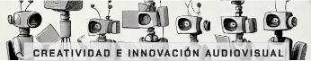

# CRIAv Creatividad e Innovación Audiovisual-B 

Facultad de Comunicación y Documentación -  Universidad de Granada

[Presentación interactiva de Asignatura](https://mgea.github.io/cdncav/) 

### Contenido de experimentación (práct)

[Proyectos Storytelling](https://github.com/mgea/storytelling) (repositorio de proyectos seleccionados) 

[Plantilla proyecto](https://github.com/mgea/my_storytelling) (repositorio de plantilla para crear proyecto de Storytelling) 

### Contenidos para ideación (teo)

[0B Crear un proyecto interactivo](https://github.com/mgea/CRIAv/wiki) 

[1B Sociedad Digital, Cultura Audiovisual](https://github.com/mgea/CRIAv/wiki)

### Herramientas de creación de contenidos

### Espacios de creación 

* [Repositorio plantilla para creación de proyectos](https://github.com/mgea/my_storytelling)
* [Catálogo de Proyectos Storytelling](https://github.com/mgea/storytelling)

---
[Creatividad e Innovación Audiovisual](https://github.com/mgea/CRIAv) / [Guía estudios](https://www.ugr.es/estudiantes/grados/grado-comunicacion-audiovisual/creacion-difusion-nuevos-contenidos-audiovis)
 
[Facultad de Comunicación y Documentación](https://fcd.ugr.es/)

CCBYNCSA M. Gea, 2025

