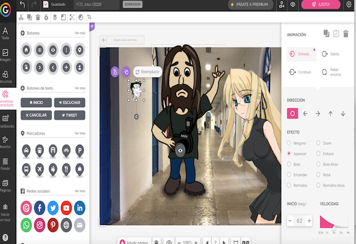
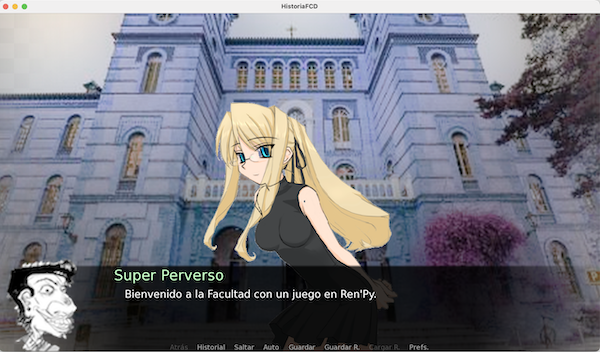

# Práctica 2B. STORYTELLING INTERACTIVO
_Prácticas de asignatura Creatividad e Innovación Audiovisual-B._ [<- Volver a menu principal](https://github.com/mgea/CRIAv)

**Objetivo**: Desarrollar una historia interactiva del estilo elige tu propia aventura (Choose your Own Adventure) con estilo de una novela visual en RenP’y.  

Se debe narrar una historia con personajes y con la inserción de decorados y música, donde el espectador puede interactuar con los personajes, 
elegir entre diferentes alternativas, etc. Crear una versión multiplataforma en (en RenPy: macOSX/Windows/Web), y probad como se visualiza en otros  dispositivos (Android). 

NOTA: Si se tiene problemas para su desarrollo, se puede realizar en plataforma alternativa (twine / genially: preferentemente).

Genial.ly
* Qué es una novela visual. https://es.wikipedia.org/wiki/Novela_visual 

 

Herramientas: 
  * Ren’py (preferentemente) https://www.renpy.org 
  * Genial.ly (sólo en circunstancias excepcionales) https://www.genial.ly/es    
  * Twine (sólo en circunstancias excepcionales)  http://twinery.org 

## Recursos: 

* Sonidos: http://soundbible.com 
* Generador de personajes: 
  * https://charactercreator.org/ 
  * https://gramener.com/comicgen/v1/ 

Galerías de personajes: 
- http://visualnovel.deviantart.com  , 
- http://visualnovel.deviantart.com/gallery/29339931/VNassets 
- http://www.spriters-resource.com 
- free assets:  https://itch.io/game-assets/free/tag-renpy 
- http://tokudaya.net/sozai-onna1.html 

<- [Volver a Prácticas](readme.md)

